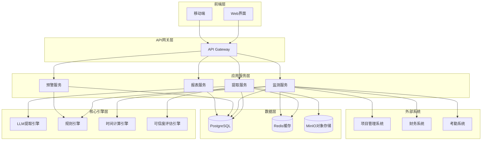

# 设计文档 - 合同结构化提取与进度监测

## 概述

本文档描述了项目质控助手的合同结构化提取与进度监测功能的技术设计。该系统采用基于大语言模型（LLM）的文档智能技术，实现合同关键信息的自动化提取，并通过规则引擎和时间序列分析实现项目全生命周期的智能监测和预警。

系统设计遵循以下核心原则：
- **准确性优先**：通过多模型验证和人工校验机制确保提取准确性
- **实时监测**：基于事件驱动架构实现实时数据同步和预警
- **可扩展性**：模块化设计支持新文档类型和监测规则的快速扩展
- **可追溯性**：完整记录提取和监测过程，支持审计和优化

## 架构

### 系统架构图




### 技术栈选择

**后端技术栈：**
- **编程语言**：Python 3.11+（AI/ML生态成熟，LLM集成便捷）
- **Web框架**：FastAPI（高性能异步框架，自动API文档生成）
- **LLM框架**：LangChain（LLM应用开发框架，支持多模型切换）
- **任务队列**：Celery + Redis（异步任务处理，支持定时任务）
- **数据库**：PostgreSQL 15+（关系型数据，支持JSON字段）
- **缓存**：Redis 7+（高性能缓存，支持发布订阅）
- **对象存储**：MinIO（文档存储，兼容S3协议）

**前端技术栈：**
- **框架**：原生HTML + Tailwind CSS（与现有前端保持一致）
- **交互**：Vanilla JavaScript（轻量级，无框架依赖）

**AI/ML技术栈：**
- **LLM模型**：支持多模型（OpenAI GPT-4、Claude、国产大模型）
- **提示工程**：Few-shot learning + Chain-of-Thought
- **向量数据库**：Qdrant（用于文档相似度检索）

**监控与日志：**
- **日志**：Python logging + ELK Stack
- **监控**：Prometheus + Grafana
- **追踪**：OpenTelemetry

## 组件和接口

### 1. 文档提取服务（Extraction Service）

#### 职责
- 接收用户上传的文档（PDF、Word、图片）
- 调用LLM引擎进行信息提取
- 计算提取结果的可信度
- 存储提取结果和原始文档

#### 核心接口

```python
class ExtractionService:
    async def upload_document(
        self, 
        file: UploadFile, 
        document_type: DocumentType,
        project_id: str
    ) -> DocumentUploadResponse:
        """上传文档并触发提取任务"""
        pass
    
    async def extract_contract_info(
        self, 
        document_id: str
    ) -> ExtractionResult:
        """提取合同关键信息"""
        pass
    
    async def get_extraction_result(
        self, 
        document_id: str
    ) -> ExtractionResult:
        """获取提取结果"""
        pass
    
    async def verify_extraction(
        self, 
        document_id: str,
        field_name: str,
        corrected_value: Any
    ) -> VerificationResult:
        """人工校验提取结果"""
        pass
```


### 2. LLM提取引擎（LLM Engine）

#### 职责
- 文档预处理（OCR、格式转换）
- 基于提示模板调用LLM进行信息提取
- 结构化输出解析和验证
- 多模型结果融合

#### 核心接口

```python
class LLMEngine:
    async def extract_with_prompt(
        self,
        document_text: str,
        extraction_schema: Dict,
        model: str = "gpt-4"
    ) -> Dict[str, Any]:
        """使用LLM提取结构化信息"""
        pass
    
    async def validate_extraction(
        self,
        extracted_data: Dict,
        validation_rules: List[ValidationRule]
    ) -> ValidationResult:
        """验证提取结果的逻辑一致性"""
        pass
    
    async def calculate_confidence(
        self,
        extracted_data: Dict,
        source_text: str
    ) -> Dict[str, float]:
        """计算每个字段的可信度"""
        pass
```

#### 提示工程策略

**Few-shot Learning示例：**
```python
CONTRACT_PRICE_PROMPT = """
你是一个专业的合同信息提取助手。请从以下合同文本中提取价格和付款信息。

示例1：
输入：签约合同价：人民币（大写）壹佰万元整（¥1,000,000.00），增值税率为6%。
输出：
{
  "含税价格": 1000000.00,
  "税率": 0.06,
  "不含税价格": 943396.23,
  "增值税": 56603.77
}

示例2：
输入：合同总价为RMB 500,000元（含税），税率13%。
输出：
{
  "含税价格": 500000.00,
  "税率": 0.13,
  "不含税价格": 442477.88,
  "增值税": 57522.12
}

现在请提取以下合同文本的价格信息：
{contract_text}

请以JSON格式输出，确保数值计算准确。
"""
```


### 3. 监测服务（Monitoring Service）

#### 职责
- 定时同步外部系统数据
- 基于规则引擎检测异常和风险
- 计算预警时间点
- 触发预警通知

#### 核心接口

```python
class MonitoringService:
    async def sync_external_data(
        self,
        system_type: ExternalSystemType
    ) -> SyncResult:
        """同步外部系统数据"""
        pass
    
    async def check_payment_progress(
        self,
        project_id: str
    ) -> List[Alert]:
        """检查付款进度"""
        pass
    
    async def check_milestone_progress(
        self,
        project_id: str
    ) -> List[Alert]:
        """检查里程碑进度"""
        pass
    
    async def check_deliverable_completeness(
        self,
        project_id: str,
        milestone: str
    ) -> List[Alert]:
        """检查交付物完整性"""
        pass
    
    async def check_compliance(
        self,
        project_id: str
    ) -> List[Alert]:
        """检查合规性（人员、履约担保等）"""
        pass
```

### 4. 规则引擎（Rule Engine）

#### 职责
- 管理监测规则配置
- 执行规则匹配和计算
- 支持规则的动态更新

#### 规则定义示例

```python
@dataclass
class MonitoringRule:
    rule_id: str
    rule_name: str
    rule_type: RuleType  # PAYMENT, MILESTONE, DELIVERABLE, COMPLIANCE
    trigger_condition: str  # Python表达式
    alert_level: AlertLevel  # INFO, WARNING, ERROR, CRITICAL
    alert_template: str
    advance_days: int  # 提前预警天数
    
# 示例：付款预警规则
PAYMENT_ALERT_RULE = MonitoringRule(
    rule_id="PAY_001",
    rule_name="付款材料提交预警",
    rule_type=RuleType.PAYMENT,
    trigger_condition="days_to_payment <= 15 and not payment_materials_uploaded",
    alert_level=AlertLevel.WARNING,
    alert_template="项目【{project_name}】第{payment_stage}次付款将在{days_to_payment}天后到期，请及时准备付款材料。",
    advance_days=15
)
```


### 5. 时间计算引擎（Time Engine）

#### 职责
- 解析相对时间表达式
- 计算绝对日期
- 处理工作日和节假日
- 计算时间差和剩余天数

#### 核心接口

```python
class TimeEngine:
    def parse_relative_time(
        self,
        base_date: datetime,
        relative_expr: str
    ) -> datetime:
        """
        解析相对时间表达式
        例如："合同签订后3个月" -> 计算绝对日期
        """
        pass
    
    def calculate_working_days(
        self,
        start_date: datetime,
        end_date: datetime
    ) -> int:
        """计算工作日天数（排除周末和节假日）"""
        pass
    
    def get_next_milestone_date(
        self,
        current_milestone: str,
        project_id: str
    ) -> datetime:
        """获取下一个里程碑日期"""
        pass
    
    def is_approaching_deadline(
        self,
        target_date: datetime,
        advance_days: int
    ) -> bool:
        """判断是否临近截止日期"""
        pass
```

### 6. 预警服务（Alert Service）

#### 职责
- 生成预警消息
- 多渠道发送通知（站内、邮件、短信）
- 管理预警状态
- 预警历史记录

#### 核心接口

```python
class AlertService:
    async def create_alert(
        self,
        alert_data: AlertData
    ) -> Alert:
        """创建预警"""
        pass
    
    async def send_notification(
        self,
        alert: Alert,
        channels: List[NotificationChannel]
    ) -> NotificationResult:
        """发送预警通知"""
        pass
    
    async def update_alert_status(
        self,
        alert_id: str,
        status: AlertStatus,
        handler_note: str
    ) -> Alert:
        """更新预警状态"""
        pass
    
    async def get_alerts(
        self,
        project_id: str,
        filters: AlertFilters
    ) -> List[Alert]:
        """获取预警列表"""
        pass
```


## 数据模型

### 核心数据表设计

#### 1. 文档表（documents）

```sql
CREATE TABLE documents (
    id UUID PRIMARY KEY DEFAULT gen_random_uuid(),
    project_id UUID NOT NULL REFERENCES projects(id),
    document_type VARCHAR(50) NOT NULL, -- CONTRACT, MEETING_MINUTES, GUARANTEE, etc.
    file_name VARCHAR(255) NOT NULL,
    file_path TEXT NOT NULL,
    file_size BIGINT NOT NULL,
    upload_time TIMESTAMP NOT NULL DEFAULT NOW(),
    uploaded_by UUID NOT NULL REFERENCES users(id),
    extraction_status VARCHAR(20) NOT NULL DEFAULT 'PENDING', -- PENDING, PROCESSING, COMPLETED, FAILED
    extraction_time TIMESTAMP,
    created_at TIMESTAMP NOT NULL DEFAULT NOW(),
    updated_at TIMESTAMP NOT NULL DEFAULT NOW()
);

CREATE INDEX idx_documents_project ON documents(project_id);
CREATE INDEX idx_documents_type ON documents(document_type);
CREATE INDEX idx_documents_status ON documents(extraction_status);
```

#### 2. 提取结果表（extraction_results）

```sql
CREATE TABLE extraction_results (
    id UUID PRIMARY KEY DEFAULT gen_random_uuid(),
    document_id UUID NOT NULL REFERENCES documents(id),
    field_name VARCHAR(100) NOT NULL,
    field_value JSONB NOT NULL,
    confidence_score DECIMAL(5,4), -- 0.0000 - 1.0000
    source_text TEXT, -- 原文引用
    needs_verification BOOLEAN DEFAULT FALSE,
    verified BOOLEAN DEFAULT FALSE,
    verified_by UUID REFERENCES users(id),
    verified_at TIMESTAMP,
    verification_note TEXT,
    created_at TIMESTAMP NOT NULL DEFAULT NOW(),
    updated_at TIMESTAMP NOT NULL DEFAULT NOW()
);

CREATE INDEX idx_extraction_document ON extraction_results(document_id);
CREATE INDEX idx_extraction_field ON extraction_results(field_name);
CREATE INDEX idx_extraction_verification ON extraction_results(needs_verification, verified);
```

#### 3. 合同信息表（contract_info）

```sql
CREATE TABLE contract_info (
    id UUID PRIMARY KEY DEFAULT gen_random_uuid(),
    project_id UUID NOT NULL REFERENCES projects(id),
    document_id UUID NOT NULL REFERENCES documents(id),
    
    -- 价格信息
    total_price_with_tax DECIMAL(15,2),
    tax_rate DECIMAL(5,4),
    total_price_without_tax DECIMAL(15,2),
    vat_amount DECIMAL(15,2),
    
    -- 时间信息
    contract_start_date DATE,
    total_duration_days INTEGER,
    requirement_design_date DATE,
    development_online_date DATE,
    trial_run_duration_days INTEGER,
    preliminary_acceptance_date DATE,
    final_acceptance_date DATE,
    maintenance_end_date DATE,
    
    -- 付款信息（JSON数组）
    payment_stages JSONB, -- [{stage: 1, condition: "", percentage: 20, ...}]
    payment_deadline_days INTEGER,
    
    created_at TIMESTAMP NOT NULL DEFAULT NOW(),
    updated_at TIMESTAMP NOT NULL DEFAULT NOW()
);

CREATE INDEX idx_contract_project ON contract_info(project_id);
```


#### 4. 里程碑表（milestones）

```sql
CREATE TABLE milestones (
    id UUID PRIMARY KEY DEFAULT gen_random_uuid(),
    project_id UUID NOT NULL REFERENCES projects(id),
    milestone_name VARCHAR(100) NOT NULL,
    milestone_type VARCHAR(50) NOT NULL, -- REQUIREMENT_DESIGN, DEVELOPMENT, TRIAL_RUN, etc.
    planned_date DATE NOT NULL,
    actual_date DATE,
    status VARCHAR(20) NOT NULL DEFAULT 'PENDING', -- PENDING, IN_PROGRESS, COMPLETED, DELAYED
    dependencies JSONB, -- 依赖的里程碑ID数组
    deliverables JSONB, -- 交付物清单
    created_at TIMESTAMP NOT NULL DEFAULT NOW(),
    updated_at TIMESTAMP NOT NULL DEFAULT NOW()
);

CREATE INDEX idx_milestones_project ON milestones(project_id);
CREATE INDEX idx_milestones_status ON milestones(status);
CREATE INDEX idx_milestones_date ON milestones(planned_date);
```

#### 5. 预警表（alerts）

```sql
CREATE TABLE alerts (
    id UUID PRIMARY KEY DEFAULT gen_random_uuid(),
    project_id UUID NOT NULL REFERENCES projects(id),
    alert_type VARCHAR(50) NOT NULL, -- PAYMENT, MILESTONE, DELIVERABLE, COMPLIANCE, etc.
    alert_level VARCHAR(20) NOT NULL, -- INFO, WARNING, ERROR, CRITICAL
    title VARCHAR(255) NOT NULL,
    message TEXT NOT NULL,
    related_entity_type VARCHAR(50), -- MILESTONE, PAYMENT_STAGE, DELIVERABLE, etc.
    related_entity_id UUID,
    status VARCHAR(20) NOT NULL DEFAULT 'ACTIVE', -- ACTIVE, ACKNOWLEDGED, RESOLVED, DISMISSED
    triggered_at TIMESTAMP NOT NULL DEFAULT NOW(),
    acknowledged_by UUID REFERENCES users(id),
    acknowledged_at TIMESTAMP,
    resolved_by UUID REFERENCES users(id),
    resolved_at TIMESTAMP,
    handler_note TEXT,
    created_at TIMESTAMP NOT NULL DEFAULT NOW(),
    updated_at TIMESTAMP NOT NULL DEFAULT NOW()
);

CREATE INDEX idx_alerts_project ON alerts(project_id);
CREATE INDEX idx_alerts_type ON alerts(alert_type);
CREATE INDEX idx_alerts_level ON alerts(alert_level);
CREATE INDEX idx_alerts_status ON alerts(status);
CREATE INDEX idx_alerts_triggered ON alerts(triggered_at);
```

#### 6. 监测规则表（monitoring_rules）

```sql
CREATE TABLE monitoring_rules (
    id UUID PRIMARY KEY DEFAULT gen_random_uuid(),
    rule_name VARCHAR(100) NOT NULL,
    rule_type VARCHAR(50) NOT NULL,
    trigger_condition TEXT NOT NULL, -- Python表达式
    alert_level VARCHAR(20) NOT NULL,
    alert_template TEXT NOT NULL,
    advance_days INTEGER,
    enabled BOOLEAN DEFAULT TRUE,
    created_at TIMESTAMP NOT NULL DEFAULT NOW(),
    updated_at TIMESTAMP NOT NULL DEFAULT NOW()
);

CREATE INDEX idx_rules_type ON monitoring_rules(rule_type);
CREATE INDEX idx_rules_enabled ON monitoring_rules(enabled);
```


## 正确性属性

*属性是一个特征或行为，应该在系统的所有有效执行中保持为真——本质上是关于系统应该做什么的形式化陈述。属性作为人类可读规范和机器可验证正确性保证之间的桥梁。*

### 提取引擎正确性属性

**属性 1：价格信息完整性**
*对于任何*包含签约合同价的合同文档，提取引擎应该提取含税价格、税率、不含税价格和增值税金额这四个字段，且不含税价格 = 含税价格 / (1 + 税率)
**验证需求：1.1**

**属性 2：价格大小写一致性验证**
*对于任何*包含大写和小写金额的合同文档，如果大写金额与小写金额不一致，系统应该标记该字段需要人工校验
**验证需求：1.4**

**属性 3：付款阶段时间顺序性**
*对于任何*包含多个付款阶段的合同文档，提取结果中的付款阶段应该按照时间顺序排列，即第N阶段的触发时间应该早于或等于第N+1阶段
**验证需求：1.5**

**属性 4：相对时间转换正确性**
*对于任何*包含相对时间表达式（如"合同签订后X个月"）的文档，给定基准日期D和相对时间表达式E，计算出的绝对日期应该等于D加上E表示的时间间隔
**验证需求：2.3**

**属性 5：里程碑依赖关系传递性**
*对于任何*项目里程碑集合，如果里程碑A依赖于B，B依赖于C，则A应该间接依赖于C，且A的计划日期应该晚于C的计划日期
**验证需求：2.4**

**属性 6：交付物去重幂等性**
*对于任何*来自多个文档的交付物清单，执行一次去重操作和执行多次去重操作应该产生相同的结果
**验证需求：3.4**

**属性 7：担保金额大小写一致性**
*对于任何*履约保证函文档，如果担保金额的大写和小写表述不一致，系统应该标记该字段需要人工校验
**验证需求：4.4**

**属性 8：人员配置阶段完整性**
*对于任何*包含人员配置要求的合同文档，如果合同定义了N个项目阶段，则提取的人员配置要求应该覆盖所有N个阶段
**验证需求：5.5**


### 监测引擎正确性属性

**属性 9：预警触发时效性**
*对于任何*监测规则R，如果规则定义了提前N天预警，当前日期距离目标日期还有N天，且触发条件满足，则系统应该生成预警
**验证需求：7.1, 7.2, 8.1, 9.1, 10.1, 10.2**

**属性 10：延期天数计算准确性**
*对于任何*项目实施环节，如果约定完成日期为D1，实际完成日期为D2，且D2 > D1，则记录的延期天数应该等于D2 - D1（工作日）
**验证需求：8.2**

**属性 11：依赖关系预警完整性**
*对于任何*具有依赖关系的实施环节A和B，如果A依赖于B，且B未完成，则针对A的预警消息应该包含B的信息
**验证需求：7.5, 8.3**

**属性 12：试运行时间重算正确性**
*对于任何*试运行阶段，如果在试运行期间发生重大故障，故障修复日期为D，则新的试运行开始日期应该等于D，新的初验日期应该等于D加上试运行周期
**验证需求：8.4**

**属性 13：交付物缺失检测完整性**
*对于任何*项目阶段M，如果该阶段要求N个交付物，实际上传了K个交付物（K < N），则系统应该识别出N-K个缺失的交付物
**验证需求：9.4**

**属性 14：违约事件记录一致性**
*对于任何*违约事件，如果系统记录了违约事件E，则应该存在对应的预警记录A，且A的触发时间早于或等于E的记录时间
**验证需求：10.3, 10.4**

**属性 15：人员数量监测准确性**
*对于任何*项目阶段，如果合同要求现场人员数量为N，考勤系统显示实际人员数量为M，且M < N，则系统应该发出人员配置不足预警
**验证需求：11.1**

**属性 16：违约金计算正确性**
*对于任何*项目核心人员变更事件，如果合同总价为P，违约金比例为R，发生了N次未经同意的变更，则计算的违约金应该等于P × R × N
**验证需求：11.4**

**属性 17：知识产权成果计数准确性**
*对于任何*知识产权类型T（软件著作权、论文、专利），如果合同要求数量为N，实际提交数量为M，且M < N，则系统应该发出对应类型的预警
**验证需求：12.1, 12.2, 12.3**

### 系统集成正确性属性

**属性 18：数据同步时效性**
*对于任何*外部系统数据更新事件，系统应该在5分钟内完成数据同步，同步后的数据时间戳应该与外部系统的数据时间戳一致
**验证需求：13.4**

**属性 19：数据格式转换幂等性**
*对于任何*需要格式转换的外部数据D，对D执行一次格式转换和执行多次格式转换应该产生相同的结果
**验证需求：13.6**

**属性 20：预警排序正确性**
*对于任何*预警列表，预警应该首先按照级别排序（CRITICAL > ERROR > WARNING > INFO），相同级别的预警按照触发时间倒序排列
**验证需求：14.3**

**属性 21：可信度评分范围有效性**
*对于任何*提取字段，其可信度评分应该在0.0到1.0之间，且如果评分低于0.8，该字段应该被标记为需要人工校验
**验证需求：15.1, 15.2**

**属性 22：逻辑冲突自动检测**
*对于任何*提取结果，如果存在逻辑冲突（如大小写金额不一致、计算结果不匹配），系统应该自动标记该字段需要人工校验
**验证需求：15.5**


## 错误处理

### 文档提取错误处理

**文档格式不支持**
- 错误码：`EXTRACT_001`
- 处理策略：返回明确的错误消息，列出支持的文档格式
- 用户反馈：提示用户转换文档格式后重新上传

**OCR识别失败**
- 错误码：`EXTRACT_002`
- 处理策略：尝试使用备用OCR引擎，如果仍然失败则标记为需要人工处理
- 用户反馈：提示文档质量可能不佳，建议提供更清晰的扫描件

**LLM调用失败**
- 错误码：`EXTRACT_003`
- 处理策略：实施重试机制（最多3次），使用指数退避策略
- 降级方案：切换到备用LLM模型
- 用户反馈：提示系统正在处理，请稍后查看结果

**提取结果验证失败**
- 错误码：`EXTRACT_004`
- 处理策略：标记验证失败的字段，降低可信度评分
- 用户反馈：在结果页面高亮显示需要人工校验的字段

**文档存储失败**
- 错误码：`EXTRACT_005`
- 处理策略：重试存储操作，如果失败则回滚整个提取任务
- 用户反馈：提示存储失败，请重新上传文档

### 监测引擎错误处理

**外部系统连接失败**
- 错误码：`MONITOR_001`
- 处理策略：记录错误日志，发送系统预警给管理员
- 降级方案：使用缓存数据继续监测，但标记数据可能不是最新的
- 恢复机制：每5分钟自动重试连接

**数据同步超时**
- 错误码：`MONITOR_002`
- 处理策略：取消当前同步任务，记录超时事件
- 降级方案：跳过本次同步，等待下一个同步周期
- 用户反馈：在监测报表中标注数据同步状态

**规则执行异常**
- 错误码：`MONITOR_003`
- 处理策略：捕获异常，记录详细的错误堆栈
- 降级方案：跳过异常规则，继续执行其他规则
- 用户反馈：发送系统预警给管理员，提示规则配置可能有问题

**预警发送失败**
- 错误码：`MONITOR_004`
- 处理策略：重试发送（最多3次），如果失败则记录到失败队列
- 降级方案：确保站内消息一定能送达，邮件和短信失败不影响核心功能
- 恢复机制：定时任务扫描失败队列，重新尝试发送

**时间计算错误**
- 错误码：`MONITOR_005`
- 处理策略：使用默认值（如当前日期），记录错误日志
- 用户反馈：在预警消息中标注时间计算可能不准确

### 通用错误处理原则

1. **快速失败**：对于无法恢复的错误，立即返回错误响应，不浪费系统资源
2. **优雅降级**：核心功能失败时，确保次要功能仍然可用
3. **详细日志**：记录完整的错误上下文，便于问题排查
4. **用户友好**：错误消息应该清晰易懂，提供可操作的建议
5. **监控告警**：关键错误应该触发系统告警，及时通知运维人员


## 测试策略

### 测试方法论

本系统采用**双重测试方法**：单元测试和基于属性的测试（Property-Based Testing, PBT）相结合，确保全面的测试覆盖。

- **单元测试**：验证特定示例、边缘情况和错误条件
- **属性测试**：验证通用属性在所有输入下都成立
- 两者互补，共同提供全面的正确性保证

### 测试框架选择

**Python测试框架**
- **单元测试框架**：pytest（功能丰富，插件生态完善）
- **属性测试框架**：Hypothesis（Python最成熟的PBT库）
- **Mock框架**：pytest-mock（简化外部依赖的模拟）
- **异步测试**：pytest-asyncio（支持异步函数测试）
- **覆盖率工具**：pytest-cov（代码覆盖率统计）

### 单元测试策略

**测试范围**
1. **提取引擎测试**
   - 测试不同文档格式的解析
   - 测试各种提示模板的效果
   - 测试可信度计算逻辑
   - 测试数据验证规则

2. **监测引擎测试**
   - 测试规则匹配逻辑
   - 测试时间计算函数
   - 测试预警生成逻辑
   - 测试外部系统集成点

3. **API端点测试**
   - 测试所有REST API端点
   - 测试请求验证
   - 测试响应格式
   - 测试错误处理

4. **数据库操作测试**
   - 测试CRUD操作
   - 测试事务处理
   - 测试并发访问
   - 测试数据完整性约束

**测试组织**
```python
# 测试文件结构
tests/
├── unit/
│   ├── test_extraction_engine.py
│   ├── test_llm_engine.py
│   ├── test_monitoring_service.py
│   ├── test_rule_engine.py
│   ├── test_time_engine.py
│   └── test_alert_service.py
├── integration/
│   ├── test_api_endpoints.py
│   ├── test_external_systems.py
│   └── test_database.py
└── property/
    ├── test_extraction_properties.py
    ├── test_monitoring_properties.py
    └── test_system_properties.py
```

### 属性测试策略

**测试配置**
- 每个属性测试运行**最少100次迭代**（由于随机化）
- 每个测试必须引用设计文档中的属性编号
- 标签格式：`# Feature: contract-extraction-monitoring, Property {N}: {property_text}`

**属性测试示例**

```python
from hypothesis import given, strategies as st
import pytest

# Feature: contract-extraction-monitoring, Property 1: 价格信息完整性
@given(
    total_price=st.floats(min_value=1000, max_value=10000000),
    tax_rate=st.floats(min_value=0.01, max_value=0.20)
)
@pytest.mark.property
def test_price_extraction_completeness(total_price, tax_rate):
    """
    对于任何包含签约合同价的合同文档，提取引擎应该提取
    含税价格、税率、不含税价格和增值税金额这四个字段
    """
    # 生成合同文本
    contract_text = generate_contract_with_price(total_price, tax_rate)
    
    # 执行提取
    result = extraction_engine.extract_contract_info(contract_text)
    
    # 验证完整性
    assert "total_price_with_tax" in result
    assert "tax_rate" in result
    assert "total_price_without_tax" in result
    assert "vat_amount" in result
    
    # 验证计算正确性
    expected_price_without_tax = total_price / (1 + tax_rate)
    assert abs(result["total_price_without_tax"] - expected_price_without_tax) < 0.01

# Feature: contract-extraction-monitoring, Property 9: 预警触发时效性
@given(
    days_to_deadline=st.integers(min_value=1, max_value=30),
    advance_days=st.integers(min_value=1, max_value=15)
)
@pytest.mark.property
def test_alert_trigger_timeliness(days_to_deadline, advance_days):
    """
    对于任何监测规则，如果规则定义了提前N天预警，
    当前日期距离目标日期还有N天，且触发条件满足，
    则系统应该生成预警
    """
    # 设置测试数据
    target_date = datetime.now() + timedelta(days=days_to_deadline)
    rule = create_monitoring_rule(advance_days=advance_days)
    
    # 执行监测
    alerts = monitoring_engine.check_alerts(target_date, rule)
    
    # 验证预警触发
    if days_to_deadline <= advance_days:
        assert len(alerts) > 0, "应该触发预警"
    else:
        assert len(alerts) == 0, "不应该触发预警"
```

**数据生成策略**

使用Hypothesis的策略（Strategies）生成智能的测试数据：

```python
# 合同文本生成策略
@st.composite
def contract_text_strategy(draw):
    """生成符合真实合同格式的文本"""
    total_price = draw(st.floats(min_value=1000, max_value=10000000))
    tax_rate = draw(st.sampled_from([0.06, 0.09, 0.13]))
    
    # 生成大写金额
    price_in_words = number_to_chinese(total_price)
    
    # 生成合同文本
    return f"""
    签约合同价：人民币（大写）{price_in_words}
    （¥{total_price:,.2f}），增值税率为{tax_rate*100}%。
    """

# 里程碑数据生成策略
@st.composite
def milestone_strategy(draw):
    """生成里程碑测试数据"""
    start_date = draw(st.dates(
        min_value=date(2025, 1, 1),
        max_value=date(2026, 12, 31)
    ))
    
    milestones = []
    current_date = start_date
    
    for stage in ["需求调研", "开发上线", "试运行", "初验", "终验"]:
        duration = draw(st.integers(min_value=30, max_value=180))
        current_date += timedelta(days=duration)
        milestones.append({
            "name": stage,
            "planned_date": current_date
        })
    
    return milestones
```

### 集成测试策略

**外部系统集成测试**
- 使用Docker容器模拟外部系统
- 测试数据同步的完整流程
- 测试错误恢复机制
- 测试并发同步场景

**端到端测试**
- 测试完整的文档提取流程
- 测试完整的监测预警流程
- 测试用户交互流程
- 使用真实的测试数据

### 性能测试

**负载测试**
- 测试系统在高并发下的表现
- 测试大文档的提取性能
- 测试大量监测规则的执行性能

**压力测试**
- 测试系统的极限容量
- 测试系统的恢复能力
- 识别性能瓶颈

### 测试数据管理

**测试数据准备**
- 准备多种类型的合同样本
- 准备各种边缘情况的测试数据
- 使用脱敏的真实数据进行测试

**测试数据隔离**
- 使用独立的测试数据库
- 每次测试后清理数据
- 使用事务回滚确保数据隔离

### 持续集成

**CI/CD流程**
1. 代码提交触发CI流程
2. 运行代码质量检查（flake8, mypy）
3. 运行单元测试（快速反馈）
4. 运行属性测试（全面验证）
5. 运行集成测试（系统验证）
6. 生成测试覆盖率报告
7. 通过后自动部署到测试环境

**测试覆盖率目标**
- 单元测试覆盖率：≥ 80%
- 属性测试覆盖核心业务逻辑：100%
- 集成测试覆盖关键流程：100%

